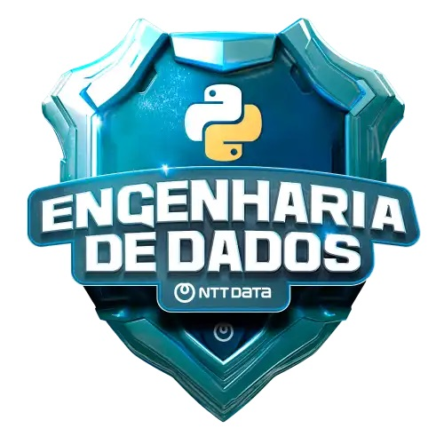

# Bootcamp Engenharia de Dados DIO

No Bootcamp de Engenharia de Dados feito pela DIO e patrocinado pela NTT DATA que foi realizado em agosto de 2024 foram abordados os seguintes assuntos:

- GIT
- Python
- Power BI

Neste repositório estão disponíveis os materiais de estudos do curso.
